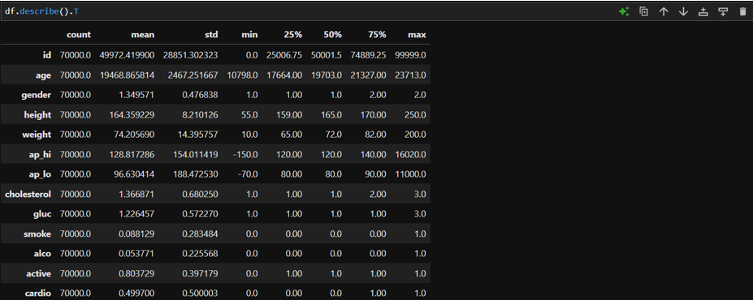
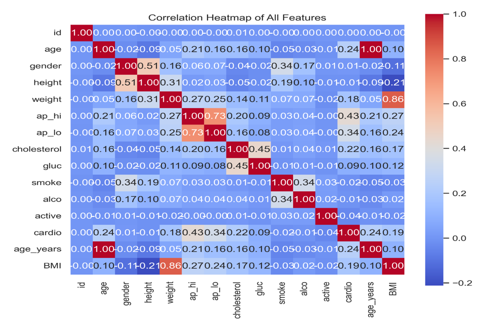
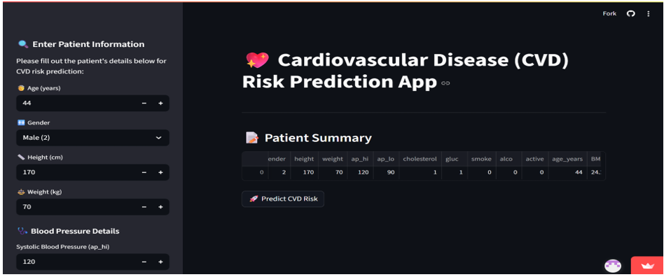
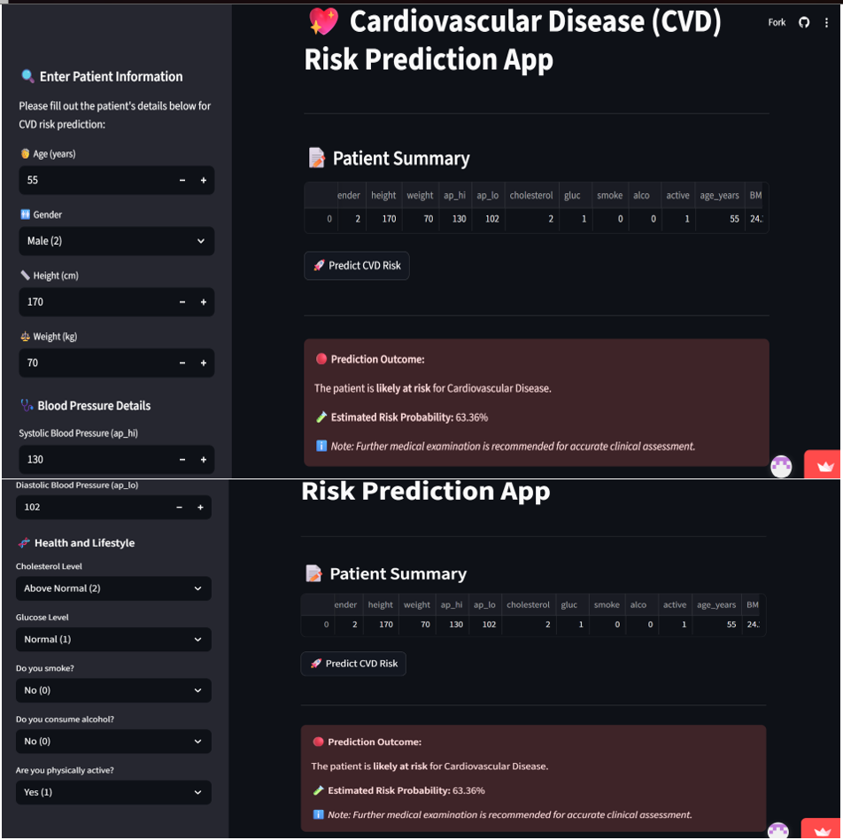

# 🫀 Cardiovascular Disease Prediction Using Machine Learning

A machine learning project that predicts the likelihood of cardiovascular disease using patient clinical data. This project compares multiple machine learning algorithms, evaluates their performance, and deploys the best-performing model through an interactive Streamlit web application.

---

## 📌 Project Overview

Cardiovascular disease (CVD) is one of the leading causes of death worldwide. Early identification of individuals at risk enables timely intervention and improved healthcare outcomes.

This project applies supervised machine learning techniques to predict cardiovascular disease using patient health indicators. Several classification models were trained, evaluated, and compared before selecting the best-performing model for deployment.

---

## 🎯 Project Objectives

The primary objectives of this project are to:

- Predict the likelihood of cardiovascular disease using machine learning techniques.
- Compare the performance of multiple classification algorithms.
- Identify the most influential clinical features contributing to cardiovascular disease prediction.
- Evaluate model performance using appropriate classification metrics.
- Develop an interactive Streamlit web application for real-time cardiovascular disease prediction.
---

## 📊 Dataset

The dataset used in this project contains anonymised patient clinical records collected for cardiovascular disease prediction. It includes demographic information, lifestyle factors, and clinical measurements commonly associated with cardiovascular health.

### Dataset Features

| Feature | Description |
|---------|-------------|
| Age | Patient age (in days) |
| Gender | Male or Female |
| Height | Height (cm) |
| Weight | Weight (kg) |
| Blood Pressure | Systolic and Diastolic Blood Pressure |
| Cholesterol | Cholesterol level |
| Glucose | Blood glucose level |
| Smoking | Smoking status |
| Alcohol Intake | Alcohol consumption |
| Physical Activity | Physical activity status |

**Target Variable**

- **Cardio = 1** → Patient has cardiovascular disease.
- **Cardio = 0** → Patient does not have cardiovascular disease.

- ---

# 📁 Repository Structure

The project is organised into modular directories to improve maintainability, readability, and ease of deployment.

```text
cvd-research-project/
│
├── app/
│   ├── app.py                      # Streamlit web application
│   ├── requirements.txt            # Project dependencies
│   ├── xgb_cvd_model_tuned.pkl     # Trained XGBoost model
│   └── README.md                   # App-specific documentation
│
├── data/
│   ├── cardio_train.csv            # Cardiovascular disease dataset
│   └── README.md                   # Dataset documentation                         
│
├── images/                         # Project figures and screenshots
│
├── notebooks/                      # Jupyter notebooks for EDA and model development
│
├── report/                         # MSc dissertation and supporting report
│
└── README.md                       # Project documentation
```

---

# 🛠️ Technologies Used

The project was developed using the following tools and technologies:

| Category | Technologies |
|----------|--------------|
| Programming Language | Python 3 |
| Data Manipulation | Pandas, NumPy |
| Data Visualisation | Matplotlib, Seaborn |
| Machine Learning | Scikit-learn, XGBoost |
| Model Evaluation | Accuracy, Precision, Recall, F1-Score, ROC-AUC |
| Web Application | Streamlit |
| Development Environment | Jupyter Notebook |
| Version Control | Git & GitHub |

---

# 🔬 Methodology

The project followed a structured machine learning workflow to ensure reliable model development and evaluation.

### 1. Data Collection

Patient clinical records were obtained and prepared for machine learning analysis.

### 2. Data Pre-processing

The dataset was cleaned and prepared by:

- Handling missing values
- Checking data consistency
- Encoding categorical variables
- Feature scaling where appropriate

### 3. Exploratory Data Analysis (EDA)

Exploratory analysis was carried out to understand:

- Feature distributions
- Correlations between variables
- Class distribution
- Potential predictors of cardiovascular disease

### 4. Model Development

Multiple supervised machine learning models were trained and compared, including:

- Logistic Regression
- Decision Tree
- Random Forest
- XGBoost
- Tuned XGBoost

### 5. Model Evaluation
Each machine learning model was evaluated using Accuracy, Precision, Recall, F1-score, and ROC-AUC to determine the best-performing model for deployment.

---

# 📊 Exploratory Data Analysis (EDA)

Before training the machine learning models, an exploratory data analysis (EDA) was performed to understand the dataset, identify relationships between variables, detect potential trends, and uncover factors associated with cardiovascular disease.

The analysis focused on:

- Understanding the distribution of patient characteristics.
- Summarising numerical variables using descriptive statistics.
- Identifying relationships among clinical features.
- Detecting variables that may influence cardiovascular disease prediction.
- Preparing the dataset for machine learning model development.

---

## 📈 Descriptive Statistics

The descriptive statistics provide an overview of the numerical features in the dataset, including measures such as mean, standard deviation, minimum, maximum, and quartiles. These statistics help understand the distribution and variability of the patient data.

<p align="center">
  
</p>

<p align="center"><em>Figure 1. Summary statistics of the cardiovascular disease dataset.</em></p>

---

## 🔥 Correlation Heatmap

A correlation heatmap was generated to examine the strength and direction of relationships between variables. Highly correlated variables may provide useful insights into cardiovascular disease prediction and feature selection.

<p align="center">
  
</p>

<p align="center"><em>Figure 2. Correlation heatmap showing relationships among clinical features.</em></p>

Each model was evaluated using several performance metrics before selecting the best-performing model.

# 🌐 Streamlit Web Application

The final tuned XGBoost model was deployed using a Streamlit web application, allowing users to make real-time cardiovascular disease predictions through an interactive interface.

---

## 🏠 Application Homepage

The Streamlit application provides an intuitive interface that enables users to enter patient clinical information and obtain cardiovascular disease predictions in real time.

<p align="center">
  
</p>

<p align="center">
<i>Figure 7. Homepage of the Streamlit cardiovascular disease prediction application.</i>
</p>

---

## 🔮 Prediction Interface

Users can input relevant patient information through the application interface. Once submitted, the trained Tuned XGBoost model processes the input data and predicts the likelihood of cardiovascular disease instantly.

<p align="center">
  
</p>

<p align="center">
<i>Figure 8. Prediction interface displaying cardiovascular disease prediction results.</i>
</p>

---

# 🚀 Installation

Clone the repository:

```bash
git clone https://github.com/reginald187/cvd-research-project.git
```

Navigate to the application folder:

```bash
cd cvd-research-project/app
```

Install the required dependencies:

```bash
pip install -r requirements.txt
```

Run the Streamlit application:

```bash
streamlit run app.py
```

---

# 📌 Future Improvements

Potential future enhancements include:

- Deployment of the application to Streamlit Community Cloud.
- Integration with electronic health record (EHR) systems.
- Hyperparameter optimisation using advanced search techniques.
- Testing additional ensemble learning algorithms.
- Development of explainable AI (XAI) features for improved model interpretability.

---

# 📌 Key Results

- Successfully developed multiple machine learning classification models.
- Tuned XGBoost achieved the best predictive performance.
- Built an interactive Streamlit web application for real-time cardiovascular disease prediction.
- Conducted exploratory data analysis and comprehensive model evaluation.
- Identified key clinical features associated with cardiovascular disease prediction.
  
# 👨‍💻 Author

**Reginald Didia**

MSc Data Science  
York St John University, London

GitHub: https://github.com/reginald187

---

# 📜 License

This project was developed for academic and research purposes as part of an MSc Data Science programme.
